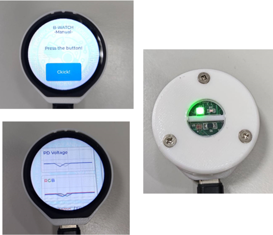

# B-Watch using ESP-IDF

This project demonstrates how to interface the CST816S capacitive touch controller with the GC9A01 TFT-LCD using the ESP32-S3 and the ESP-IDF framework. It is designed for developing a **Blood Monitor Watch** to detect bleeding wounds.



## Requirements
### Hardware
- [ESP32-S3 LCD ESP32-S3-Touch-LCD-1.28](https://www.waveshare.com/esp32-s3-touch-lcd-1.28.htm)
    - ESP32-S3 development board
    - GC9A01 TFT-LCD
    - CST816S touch controller module
- Sensor PCB (from NCKU WTMH LAB)
    - PCB材料清單
    -

### Sofrware
- VS code IDE
- ESP32-IDF (version 5.15.5)
- LVGL library (version 8.3.11)
- 

## Hardware Setup

| Function            | ESP32-S3 GPIO Pin | GC9A01 Pin   | CST816S Pin  |
|---------------------|--------------------|--------------|--------------|
| **LCD SDA**         | GPIO 21           | SDA          | -            |
| **LCD SCL**         | GPIO 22           | SCL          | -            |
| **LCD Reset (RST)** | GPIO 15           | RESET        | -            |
| **LCD DC**          | GPIO 2            | DC           | -            |
| **LCD CS**          | GPIO 5            | CS           | -            |
| **LCD BL**          | GPIO 4            | BL           | -            |
| **Touch INT**       | GPIO 13           | -            | INT          |
| **Touch RST**       | GPIO 5            | -            | RST          |
| **Touch SDA**       | GPIO 18           | -            | SDA          |
| **Touch SCL**       | GPIO 19           | -            | SCL          |

**Note:** Some GPIO configurations from Waveshare's website may not be accurate. Verify your connections manually for correctness.

## Software Configuration  
Ensure that your `sdkconfig` has the necessary I2C drivers enabled.

### Installing ESP-IDF in VS Code  
Use the [ESP-IDF Extension for VS Code](https://github.com/espressif/vscode-esp-idf-extension) to set up your development environment.

### Installing Libraries Provided by Espressif  

1. **LVGL - Light and Versatile Graphics Library**  
   - Add via ESP-IDF Terminal:  
     ```bash  
     idf.py add-dependency "lvgl/lvgl^8.3.11"  
     ```  

2. **ESP LCD Touch CST816S Controller**  
   - Add via ESP-IDF Terminal:  
     ```bash  
     idf.py add-dependency "espressif/esp_lcd_touch_cst816s^1.0.3~1"  
     ```  

3. **ESP LCD Touch Component**  
   - Add via ESP-IDF Terminal:  
     ```bash  
     idf.py add-dependency "espressif/esp_lcd_touch^1.1.2"  
     ```  

4. **ESP LCD GC9A01**  
   - Add via ESP-IDF Terminal:  
     ```bash  
     idf.py add-dependency "espressif/esp_lcd_gc9a01^2.0.0"  
     ```
     
5. **Component: Button**
   - Used to control esp32 turn into/ wakeup from deep sleep mode.
   - Add via ESP-IDF Terminal:  
     ```bash  
     idf.py add-dependency "espressif/button^3.4.0"
     ```
     
### Installing Additional Libraries  

1. **Arduino as an ESP-IDF Component**  
   - Open the ESP-IDF project in VS Code.  
   - Press `F1`, then select:  
     ```Add Arduino ESP32 as ESP-IDF Component```  
   - Modify `sdkconfig` as follows:  
     ```c  
     CONFIG_FREERTOS_HZ=1000  
     ```  

2. **Adafruit_ADS1X15**  
   - Copy the library to `/esp-project/components`.  
   - Create a `CMakeLists.txt` file in `/esp-project/components/` with the following content:  
     ```cmake  
     idf_component_register(SRCS "Adafruit_ADS1X15.cpp"  
                           INCLUDE_DIRS "."  
                           REQUIRES arduino Adafruit_BusIO)  
     ```  

3. **Adafruit_TCS34725**  
   - Follow the same process as **Adafruit_ADS1X15**.  

4. **Adafruit_BusIO**  
   - Follow the same process as **Adafruit_ADS1X15**.  


## Partition Scheme  
1. Open the SDK Configuration Editor (`menuconfig`).  
2. Select **Partition Table** and import the `partitions.csv` file from your project's main directory.  
3. Verify that the following settings are in `sdkconfig`:  
```
CONFIG_PARTITION_TABLE_CUSTOM=y
CONFIG_PARTITION_TABLE_CUSTOM_FILENAME="partitions.csv"
```
  
**Note:** Ensure that your ESP-IDF version is between `5.1` and `5.2`.  


## Project Structure


## Code Overview
### I2C Initialization
123test

### SPI Initialization
asdtwst

### LVGL Touch Integration
qwewqeas


## Troubleshooting
### Initialize LCD pixel with random values


### ESP-IDF Monitor
Error loop about [I2C Read Failed (IDFGH-11933) #13013](https://github.com/espressif/esp-idf/issues/13013)
```
Loop{
    E (5274) CST816S: read_data(108): I2C read failed
    E (5306) lcd_panel.io.i2c: panel_io_i2c_rx_buffer(135): i2c transaction failed
}
```


## 還未整理
https://www.cnblogs.com/yinsua/p/18202710

https://github.com/espressif/esp-bsp/tree/master/components/lcd_touch/esp_lcd_touch_cst816s

## Reference
https://github.com/espressif/esp-idf/blob/master/examples/peripherals/lcd/spi_lcd_touch/main/spi_lcd_touch_example_main.c


